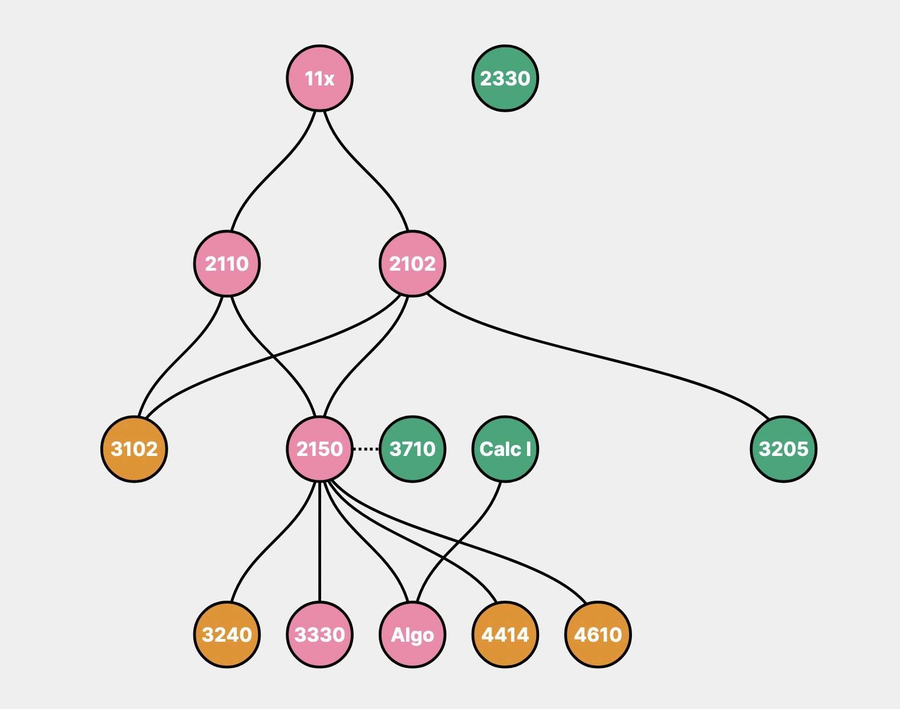

# UVA CS Skilltree
A (work in progress) visualization of courses and their pre-requisites in the University of Virginia's BACS program. Made with [d3.js](https://d3js.org/).

[View the live demo.](https://kerrigan.dev/skilltree)
